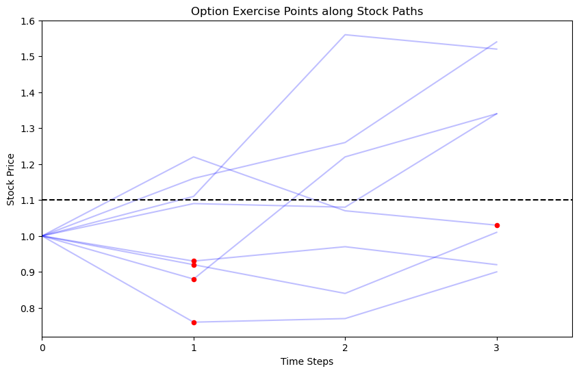
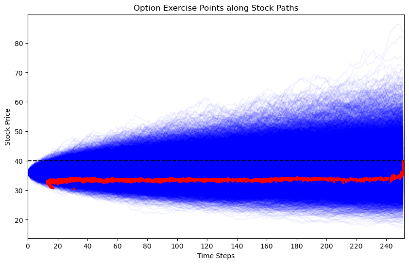
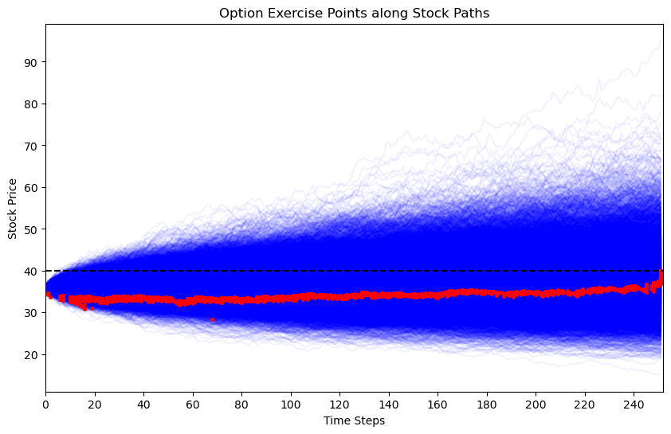

# Longstaff-Schwartz

Valuation of American Options

## Problem

Americans options are financial derivatives that can be exercised at any time before expiration. This flexibility makes them more valuable than European options, which can only be exercised at expiration. Contrary to European options that can only be exercized at expiration, there is no analytical formula to value them.
 The Longstaff-Schwartz algorithm is a method for valuing American options. It is a Monte Carlo method that uses regression to estimate the conditional expected value of the option at each time step.

 These results are derived from the original paper: *Schwartz, Francis A. Longstaff Eduardo S. "Valuing American Options by Simulation: A Simple Least—Squares." (2001).*

Result for the dummy example in the paper are shown below. The results are consistent with the paper.
 
 Results for order 2 and 3 on more comple paths are shown below.
 
 
